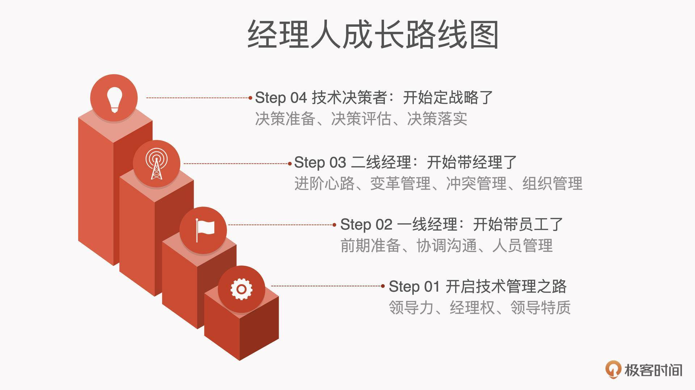
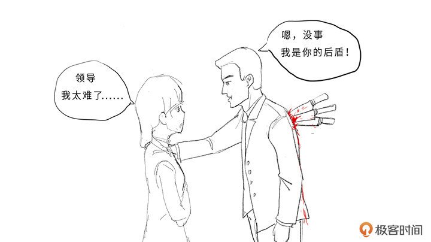

---
date: "2019-06-23"
---  
      
# 开篇词 | 一个技术总监的管理“自白”
你好，我是许健。欢迎来到我的“技术管理案例课”！

我是一个在IT行业摸爬滚打了16年的老兵，算起来我走上管理岗位也有8年了。现在我是eBay基础架构工程部的研发总监。和很多人不同的是，我不是“被迫”走上管理岗位的，我是主动要求的。

记得那会儿我差不多已经工作了8年，感觉自己在技术上还可以，但是离独当一面还是有一定差距的。那时我就想多做点事，不希望哪天有什么机会轮到我的时候，却发现自己能力不够。于是，我找到了我的老板，跟他表明了自己的想法，希望能够得到更多锻炼的机会。

虽然我已经做足了心理准备，但是真的走上管理岗后，我还是进入了迷茫期。我觉得自己的技术竞争力在消退，团队里人的问题也层出不穷，比如：当时我大部分的精力都放在了开会上，所以没有沉到一线了解细节，也没能静下心去梳理团队的长期规划，更没有专门找时间，去培养自己跟团队关键人员的信任关系……最终这些问题在一次组织变动的时候就一起爆发了。

那时候，我真的觉得自己撑不住了。

现在回过头来看，我感恩经历的这所有事情，这些酸甜苦辣塑造了现在的我。回顾自己这些年的成长，我发现****技术管理最有效的学习方式有两种：一种是在实战中自己反思和总结；另一种是有人结合真实的案例，一对一地给你分享经验。****

<!-- [[[read_end]]] -->

所以，我想通过这门课把自己经历的这些“坎儿”分享给你，一对一地给你分享我的经验。如果你现在还不是经理，我希望你看完课程后，能更好地理解经理的思路，从而指导你更有效地工作；如果你已经是一名经理，也正处于迷茫期，希望我的案例分析能和你产生共鸣，给你提供一些参考，让你少走一些弯路。

我先给你分享一个之后课程里还会细讲的案例吧。

有一次，在一个项目A上，我跟总部领导意见不一致。首先，意见不一致本身我心情就不会很好。在我坚持自己的主见的过程中，团队里又有人离职，员工离职直接影响到项目交付，也会影响到其他在职人员的士气。雪上加霜的是，有些不了解的情况的人也开始拿这个在公司论坛上来说事。我当时真的是负重前行，觉得十分艰难。像这种复合的难题，到底要怎么处理呢？

我的解决方案具体有下面四个维度：**想好对策、调整心态、理顺思路和求助上级**。

首先针对业务交付，制定出最坏情况的应对对策；然后你自己要做好情绪管理，直面困难；接着清醒地分析团队怎么稳住，不影响交付的前提下满足团队人员的诉求，提振士气；最后，还要有“把上级纳入你的团队”的思路，团队外部协同上遇到问题时，你一定要主动求助上级。

你看，我只是随手给你举了一个发生在我身上的例子，其实背后有一系列可以思考的内容和对策。放到我们管理的层面，这样的事情经常发生，怎么处理呢？其实我觉得方法都是一样的。

那对应的，我就想用我这一整套的思维方式和做事方法来给你讲这门课。具体我会怎么给你讲呢？

首先，我一直有记录、总结、复盘的习惯。做管理这么多年，我把我自己经历的挫折、受过的委屈、获得的赞赏，全都系统梳理了一遍，并精选了一些做技术管理的过程中最有共性的、同时我印象最深刻、促使我成长最快的案例，与你一一进行抽丝剥茧，逐个复盘分享。

其次，我还会和你分享这些常见问题的解决方法。我不仅会给你展示应该怎么做、怎么说的正确方案，我还会把那些很多人都会犯的错误，都给你一一列出来，让你清晰、明确地知道这之间的差距。除此之外，我还会给你讲清楚，这些解决问题方案背后的思考路径。这样，你不但掌握了管理提效的方法，也能参考我的思维方式，建立你自己的“管理模型”。

每一个成长飞速的选手，都有一套行之有效的复盘方法。因此，除了方法，我还希望你能从这门课中学到工作复盘的正确路径。这样，你还可以拓宽自己看问题的视野，学会怎么用复盘优化自己的管理能力。做案例分析时，我也是在带着你不断演练复盘的技巧。我将把我遇到的困难、应对方法，以及事后反思、迭代的全过程，按步骤为你一一呈现。

为了带你循序渐进地学习，我会通过**技术管理之路的开启、一线经理、二线经理、技术决策者4个模块**，逐步分享我的心路历程和实战案例。

你可以先看看下面这个我为你梳理的**技术管理技能全景图**。你可以结合自己的情况快速对照，看看自己哪些做得比较好、哪些做得还不够、哪些目前还没想到。

学完了这4个模块的内容，你就掌握了我这8年的技术管理实战经验。这一门技术管理案例课，其实就是**带着你经历“挫折”**。我们就像侦探一样，回到每一次“事故”的现场，抽丝剥茧地剖析问题，找到解决方案，并总结方法论。

那我就先带你感受一下“受挫”的滋味吧。

挫折一：

你现在是一线经理，团队里有好几个高级员工，他们个人能力强，性格也很强，想法跟你不一致的时候是会直接“开炮”的。你虽然戴着经理的帽子，但实际上你“领导”不了他们。怎么办？

挫折二：

你现在已经是二线经理了，开始带经理，团队也变大了，你突然发现自己的时间完全不够用，每天在各种会中串场。但是忙碌的你并没有管理好自己的团队，你发现你把自己给架空了。想要管理好一个更大型的组织，你一筹莫展，怎么办？

挫折三：

现在你需要做很多技术决策了，但是你持续和更高级别的领导意见不一致，总部领导不开心，你自己也不开心，决策根本落不下来。你发现自己陷入这种情况，又该怎么办？

这几个场景还是很典型的，不知道你是不是正处在其中。可以先想一想，面对这样的问题，你有解决方案吗？如果你的问题还没解决，或者你对现在的解决方案还不满意，那就和我一起在课程里探索吧。

相信，在课程结束的时候，你会和我一样，感谢这些挫折。因为每一次挫折都不会打倒我们，反而是遇到挫折之后，总会让我们发现问题、分析问题、找到解决方法，最能提升我们的管理实力。

说了这么多，那到底啥是管理呢？我们没必要执着于一个最正确的定义，核心是这个概念能指导我们的实践。

结合自己的经验，说到底，我觉得**管理就是通过培养人来做成事**。也就是说，管理要交付两个维度的结果，一个是交付业务价值，另一个是培养人，这两点相辅相成。

培养人不是天天跟员工苦口婆心，不是天天跟员工客客气气，而是高标准严要求，严师才能出高徒。管理者要有父母心，我正是因为希望你好，才对你这么严。把你带到山顶，一把把你推下悬崖看你自己爬，在你快摔下去的时候却又能拉你一把。

做成事意味着管理是需要不断地交付业务价值的，但也不是什么价值都要交付，我认为你要“集中力量办实事儿”，你要有你的主线并做聚焦和长期投入。而在你选择这条主线的同时，也意味着你放弃了其他的主线，真正难的其实是抗拒诱惑、学会放弃主线外的干扰项。

管理更多的是一份沉甸甸的责任。你的决策、你的情商、你的逆商很大程度决定了你的团队和团队成员的发展。你所有的决定，都不再只关乎你一个人的利益。从此，你也就基本告别“随性”了，想发脾气的时候你要忍，遇到困难想放弃的时候你要坚持。

我之前看过一张图，图片里面画了一个人，这个人自己背上插着一把刀，但是另一边他还在鼓励别人，看到后我真是很感慨。做管理其实也是这样啊，你就是那个自己身上插着刀，还要负重甚至负伤前行的人。

好了，说到这里我已经感觉很激动了。我非常期待想要给你分享我踩过的那些血泪坑，把自己这些年经历的案例拿出来，希望能用我的反思，给你一些参考和启发，希望带你养成学习和反思的习惯，让你少走一些我走过的弯路。

当然，我更希望你今后无论遇到怎样的“坎儿”，都要坚定自己的信念，摆好心态，越挫越勇，成就团队，成就自己！让我们一起开启这趟管理的旅程吧！