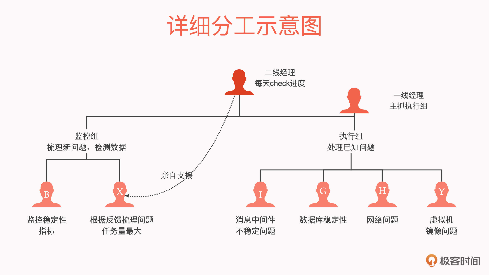

---
date: "2019-06-23"
---  
      
# 13 | 变革管理：如何从“拥抱变化”到“发起变化”？
你好，我是许健。今天我们聊一聊变革管理这个话题。

一般进入一家公司后，我们都会被告知要拥抱变化。比如我加入eBay先去了搜索后端部门，后来搜索部门都调回了美国总部，我和同事们被调配到云计算部门，经理再次强调了要拥抱变化，于是我们就从头开始学云计算。也有不愿意学的人，最后就离开公司了。

后来我转岗做了经理，做着做着就发现遇到了瓶颈，想要做得更好却做不到，我慢慢地意识到我们需要变革，于是开始了从拥抱变化到发起变革的转变。

接下来，我就跟你聊聊发起变革的那些事儿。

## 拥抱变化：培养对变革的感觉

回看我当经理的经历，我刚转岗做一线经理时就只能看到IaaS Provisioning系统这一块，整天想的也就是要如何提高这块系统的可靠性。

那时我是一个执行者的角色，并不知道我们组织有什么问题，也没有想过要把这个产品做成什么样子，更别说对整个部门有什么长期规划了。

我举个例子给你说说我当时的状态，前面[人才培养](https://time.geekbang.org/column/article/283313?utm_source=pinpaizhuanqu&utm_medium=geektime&utm_campaign=guanwang&utm_term=guanwang&utm_content=0511)那一讲我提到过，领导找人做我的Mentor，我的Mentor就是Wilson。有一次Wilson问我：“许健，公司里那些组织变动的announcement邮件你看吗？”我说自己不看的，毕竟看也看不懂，很多邮件的内容感觉跟我也很远，所以都是直接送垃圾邮箱的。

<!-- [[[read_end]]] -->

Wilson却告诉我，他不但会看，而且还会试着理解这些组织变动背后的原因，有些变动甚至在发生之前Wilson就有预测，所以他会对比最后的announcement和自己预测的有什么不同，然后思考为什么不同。

总结一下Wilson提出的对比法，其实就是**把实际发生的变革和自己推断的变革进行比较。**做这个对比有什么作用呢？作用就是可以锻炼经理对组织变革的判断能力。

我意识到这个对比法后曾尝试练习，但因为没有足够的背景信息和当时积累不够，发生在身边的组织变革我也是后知后觉，这让我觉得自己对组织的变革敏感度还要提升。

那么问题来了，**经理对变革的敏感度到底该怎么培养呢？**除了对比，我发现细致地做推演更重要，这个灵感也是多年之后，我成了二线经理才体会到的。

在这里我给你总结一个**三步推演法**：

首先，经理要能够看得到组织的问题。

其次，要分析组织要怎么安排才能增加解决这个问题的成功率。

最后一步，评估问题解决的收益和组织变动需要付出的代价，然后想一想这个代价可以接受吗？

经常思考上面的问题，我们就能慢慢培养出对组织变革的敏感度了。用上这个推演思路后，再结合Wilson的对比法，我发现自己的判断也越来越准确了。

记得我们公司新的首席产品官推出了一系列CPS（Customer Problem Statement），也就是一系列重要的客户不满意的问题，并且对整个产品部门提出了这样的要求，安排工作要围绕解决客户问题这个核心点进行。

我当时就想，接下来也许会按这个要求做组织重组了。后来发生的一系列的组织变动果然就是按照CPS来进行的。

要知道敏感度和判断力都来源于多观察，多思考。将来有一天如果轮到我们发起变革了，这些前期的积累会有很大帮助。

## 发起变革

在成为二线经理的初期，我们更多的是培养自己对变革的感觉，为自己更好地拥抱变革做积累。我们要主动关注领导是如何发起变革的，这样做自己也能逐渐发现组织的问题。

思考了很多，没有实际操练还是火候不到，那什么情况下二线经理自己要主动做变革呢？

如果有个问题严重到影响你的团队效率，但是又没有人站出来解决，这时我们就应该主动发起变革了。那么发起变革又有哪些关键事项呢，下面我就通过案例给你详细说一说。

**案例背景**  
时间回到2014年，当时我团队有16人，分成4个小组，每一个小组都跟美国一个团队对应。其中我直接负责的只有一个做云计算内部监控的小组，其余三个小组的所有工作都是美国的经理直接安排的，说白了我就是一个人事经理罢了。

当时我们公司云计算平台C3主要是在OpenStack上，客户因为平台不稳定很不满意。于是我就动了组织变革的念头，想集中上海这16人的力量来提高C3稳定性。

**推演思路如何落地**

现在我们对照前面提到的组织变革三步推演法，实际分析一下这个案例。

首先是**找到关键问题。**我找到的关键问题是：云计算这个组织的最主要产品是云计算平台C3，但是客户对C3的稳定性很不满意。

为什么这样判断呢？我去参加总经理的Offsite，一堆同事群起而攻之，指着鼻子说云计算部门不解决客户问题。我相信总部那里的客服反馈也差不多，总部云计算平台的一把手也深知这一点，但是当前组织的大部分力量都在做什么？他们都在做新功能而不是修复现有系统的稳定性问题。

所以，我觉得必须要把现在云计算平台的业务质量提高，而这里最大的痛点就是解决C3的稳定性问题。

接下来是**推演解决方案。**找到关键问题以后，推演解决方案就很顺畅了。有个[故事](https://time.geekbang.org/column/article/89923?utm_source=pinpaizhuanqu&utm_medium=geektime&utm_campaign=guanwang&utm_term=guanwang&utm_content=0511)我推荐你看一看，就是马云曾经停掉支付宝的所有新功能，强制要求整个支付宝公司做变革，目标是把支付成功率从70\%提升到90\%。

本质上我这里的变革思路跟支付宝提高成功率是一样的。解决方案很直接，就是把组织的骨干力量从新功能上撤出，转到解决客户当前关心的主要问题上。

最后一步是**评估投入产出。**想要做成这件事要付出什么样的代价呢？就是一旦我们抽调一个骨干，那个骨干所在的新功能就会受影响，连带着负责那个新功能的经理就会受影响。

那大面积影响美国团队和大面积影响中国团队，这两个方向总部领导会做何选择？我的判断是总部领导会选择让中国团队做组织变革，虽然这个变革要付出代价，但也是中国的云计算负责人希望的。

总结一下，我愿意跳出来解决总部领导当前很头痛的问题，而且总部领导付出的代价可控，所以发起这个变革的可能性很高。如果能做好，上海的团队将不再是一盘散沙，我也不再是人事经理。所以，我决定主动发起这个变革。

确定了要变革，具体怎么做呢？这里有两个关键事项，一个是向变革涉及到的关键人物讲清楚我的想法，另一个是说服上级领导支持变革。

**正面冲突，把话当面讲清楚**

我想集中力量搞稳定性，就要完全停掉经理T在上海的原有安排，所以我申请去美国出差找T沟通。在美国见到T后，T希望我不要改变他的原定计划，我当时拉不下脸直接拒绝，并没有把话当面讲清楚。我只记得当时说，好吧，我再考虑考虑。

其他经理对变革的态度基本上是中立的，他们认同我要做的是正确的事情，同时又觉得原来计划的工作也很重要。在我飞回上海的路上，我觉得出这趟差什么也没有做成，白白费了公司几万元差旅费。

没过几周，总部的负责人S来上海例行视察，这次我铆足了劲，态度坚决，有理有据，一定要达成变革目标。

具体怎么说服S的我会在后面细讲，这里先说结果。S在上海待了一周，周五晚上飞回了美国，下周的周一就直接宣布了变革决定。

因为我出差时没有和经理T明说，他的理解是这件事儿我们还在谈，结果T突然收到领导这样的通知，自然很不高兴。T经理非常生气，他觉得我不把话当面说清楚，背后使绊子。

当时我的情绪管理做得也不够成熟，S宣布决定后我跟T打电话情绪也比较激动，还记得T在Skype上跟我说“Jian，watch your mouth！”过了一年多，我和T的关系才缓和。

回顾看我跟T交互的过程，我总结了两点经验：

* 在美国的时候，我其实完全可以当面跟T讲清楚我的想法，我就是为了集中力量把可靠性搞好。那为了做成这件事，我需要停掉你原来的工作安排。T也是讲道理的人，他后来对我这么生气，症结就是我没有在他面前把话说明白。
* 我讲清楚我的想法以后，我期望得到T的支持这一点，其实可以和他明确表达出来。

若干年后我已经负责带领更大的团队了，摩擦总会有的。我跟总部云计算高级总监有一次推心置腹的沟通，他也跟我提出来我们可以持不同意见，但是应该互相把想法讲清楚。大家都没有私心，没有什么不可以摆在台面上的，要么不说，要说就说得彻底。

**如何说服上级领导支持变革**

故事要回到S在上海的那一周，那时我做了什么呢？其实就是把变革的三个问题回答好。哪三个问题呢，我们一起看看：

第一，**问题非解决不可吗？**也就是解决Cloud Reliability这个问题，是不是S眼中的重点问题？只有重点问题，领导才会为了解决它而支持你发起变革，哪怕要影响总部各个经理的原定计划。

我们当时云计算部门自己的报表显示稳定性在99\%，但是客户不买账，说给我们的服务发请求失败频率很高，发十次请求失败七八次，甚至有一个客户给副总写邮件列举了云计算七宗罪。我判断S面对客户也承受着很大压力，问题再不解决，S有可能位子不保。

第二， **解决问题具体怎么做？**我给S做了详细分析，把做成Cloud Reliability这件事要解决掉的几大问题逐条列出来。

我们要解决RabbitMQ消息中间件的稳定性问题，要提供能反映用户体验的指标，还要解决虚拟机启动时网络配置问题……每一条都我列得都很具体，这样领导才知道，我提起这个变革是经过深思熟虑的。

第三， **为什么解决这个问题要交给我来做？**最后这一步很重要但却很容易忽视，就算是你提了方案，为什么领导要把这个方案交给你来执行呢？

我们始终要记得领导最最关心的就是结果，所以必须向领导阐述解决第二步里的问题需要什么样的人才配置，说明我们就拥有这些人才配置，所以我们才是他手下最有可能办成这件事的人。

因为解决了前面说的这三个问题，我才说服了领导支持变革提议。我觉得重要项目需要领导真正的支持，而不仅仅是口头支持。

那么如此重要的事情，我们有哪些具体的事项需要领导帮忙呢，我和领导S提了下面3个要求：

* 需要请S来宣布变革决定，也就是美国总部那里原定计划变更，上海将集中力量改进Cloud Reliability。
* 我请S请上海的骨干一起吃饭，当面告诉他们这件事对组织的意义，激励这些骨干。我私下跟S说如果事情做成了，希望对这些骨干在年底绩效考评的时候有所体现。
* 需要领导提供人员上的支持，我们毕竟远在上海，我需要总部安排一个项目经理来帮忙协调上海对总部的需求。我还希望美国总部技术实力最强的经理D参与进来，在必要时提供技术支持。

上面说的支持需求，S全部答应了。我现在经常对我的部下说，如果我决定让你改变原计划去做一件我认为很重要的事情，你要是对我一点要求都不提，我会觉得不安，所以发起变革时，我们需要上级给什么支持，一定要提出来。

## 发起变革后的前三个月

变革启动后的前三个月是关键期，变革是打破原有的方式，前期拖得太长，容易出变故。所以我们需要在前三个月有产出，才能增强所有人对变革的信心。

接下来我们就聊聊在Cloud Reliability Program（后面简称CRP）那次变革的前三个月，我是怎么做的。

**第一，前三个月的执行必须亲自指挥。**

作为二线经理，可以把执行交给一线经理，但是在这段时间，我们的主要精力必须专注在变革的执行上。我当时做了详细的分工：

* 两个人做监控分析工作。B负责监控量化我们的稳定性指标，这样到底稳定性提高了多少大家一目了然。X负责对现有客户反馈的问题一个一个分析。
* 四个人处理已知问题。J负责攻克最棘手的消息中间件不稳定的问题，G负责数据库的稳定性，H负责网络问题，Y 负责虚拟机镜像问题。
* 我们每天都要自己过一下进度，因为X那边要分析的问题量比较大，我就和他一起做分析。

**第二，早做推演，找到可能导致这三个月既定计划无法实现的风险点，及早做出部署。**

换句话说，就是如果三个月后变革失败了，会是因为三个月前没做好哪些工作呢？不要以为艰难的决定在发起变革那一步就结束了，后续还有很多问题。

一个典型的问题就是对别人的依赖，注意这个时候把事情做出来，要比把事情做完美要重要，三个月内的目标一旦确定就不要轻易扩大，打移动靶多半会失败。

具体在CRP这件事上，当时我们最棘手的技术难题是消息中间件不稳定，所以一定是安排全组技术实力最强的人去解决。即使是这样，我们在前面近两个月都没有明显进展，压力很大。两个月过去后终于找到了问题，团队真的特别开心，信心也一下子起来了。

接下来又碰到了OpenStack升级，稳定性又跌下来，后来我跟美国的另一个经理D协商又停掉了一个项目，把另一个骨干也拉进来一起解决这个问题。

现在回顾OpenStack升级这件事，我发现这个风险点本该推演出来的，如果现在的我回到当年，就会坚持延后OpenStack升级，减少这个不确定因素。

**第三，****保持执行的完全透明。**

每周给上级领导发工作汇报，每个月做月度汇报，有困难不要藏着掖着。我当时就是每周都向总部做进展汇报，我们和总部毕竟隔着个太平洋，而这次变革也是力排众议进行的，如果沟通不及时、不到位，就会造成总部领导不满，甚至对我们的信心动摇。

这种隐患在上海很难及时处理，所以我们请总部的一位华人来做项目经理，因为他跟我们信任度很高，所以找他负责跨洋沟通。这么安排是为了总部领导有任何问题都能得到及时解答。总部那边有什么情况，我们也可以通过这名项目经理及时了解，然后做出调整。

在整个变革过程，肯定会有困难，但是我们一定要给部下和上级展示出我们的坚定信念。如果真的出现问题，那就算砍功能也不要轻易改动原定交付时间，因为确定的交付时间对外就是一个承诺，而对内是一口气，这口气不能泻。在约定的时间内能准时交付，团队就会更加有信心。

## 总结

变革不易，从被动地接受变化到有能力主动发起变革，这是二线经理的一个重大进步。

我们要发起变革，首先要对于组织当前的重点问题有清晰的认识，平时就要培养对变革的敏感度，思考怎么通过组织变革进一步释放组织效率。

真正要发起变革肯定会影响到一些关键人员的利益，这时不要回避，摆在台面上讲清楚，给予相关人员足够的尊重。

说服领导的思路要围绕着“怎样做才能最大可能解决组织痛点”来构建。关键是和领导沟通好三个内容：**这个问题非解决不可吗？解决问题的具体方案？为什么这个变革要交给我来做？**

发起变革一定要获取上级领导的支持，这个支持不只是口头的，有关具体事项的需求也要提出来。

请你注意，发起一次变革只是起点，变革的关键期在启动后的前三个月，二线经理必须在这个期间亲自上阵指挥，专注于变革的执行，做详细分工，并根据推演到的风险点早做部署。

对变革管理有兴趣的同学，我强烈推荐你学习一下中国历史上的变法，体会这些变法成败背后的原因。

## 思考题

后来我又做了开发部门和运维部门的整合，开发部门觉得运维部门不思进取，而运维部门觉得开发部门也有问题，问题有两个：因为启动的新项目并不真正解决线上的实际问题，做事老是缺少最后一公里，这个欠缺还是要运维部门去填。

1.  如果你是我，准备怎么来做这两个部门的整合工作呢？
2.  如果你是开发部门或者运维部门的一员，你又准备做些什么？

欢迎在留言区晒出你的经历和疑问。如果有收获，也欢迎你把这篇文章分享给你的朋友。