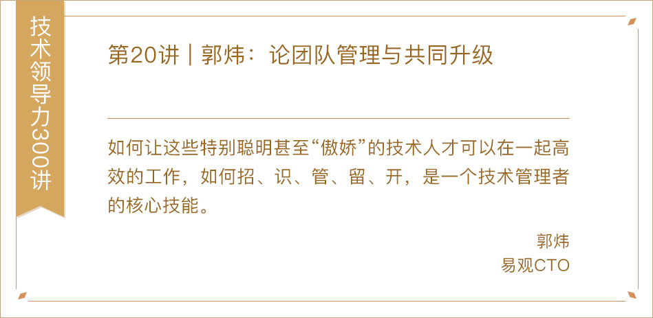
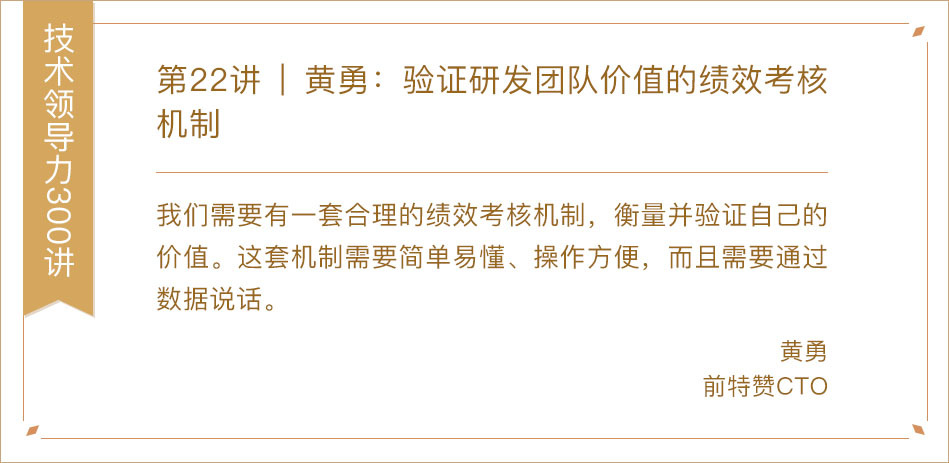
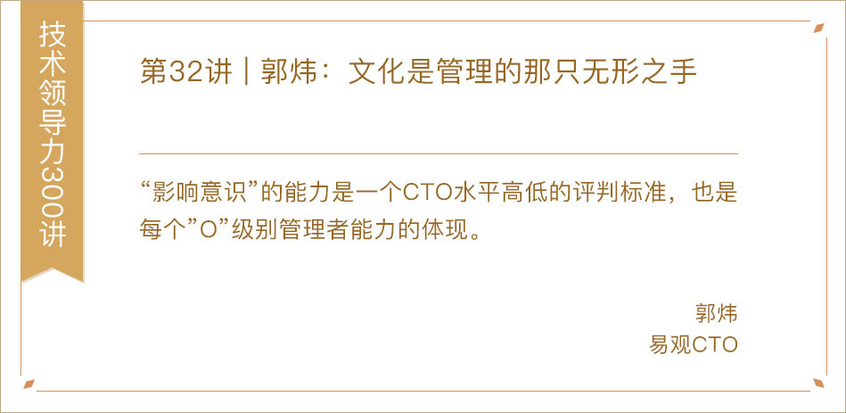
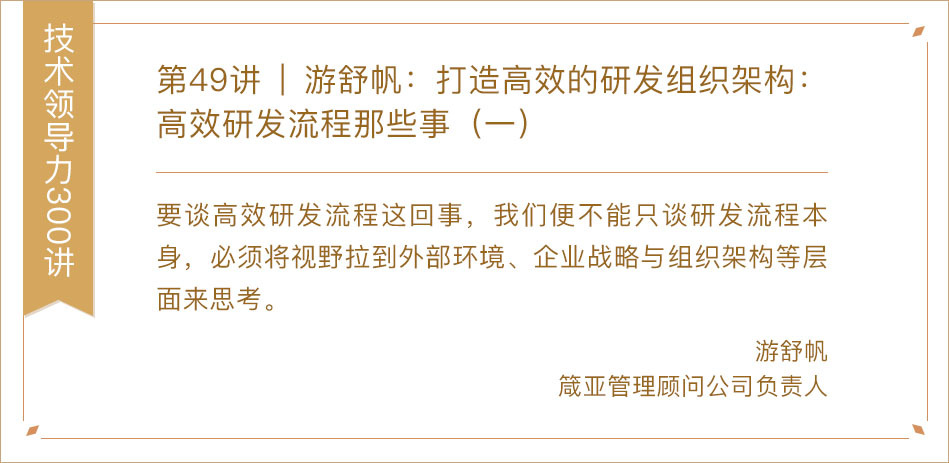
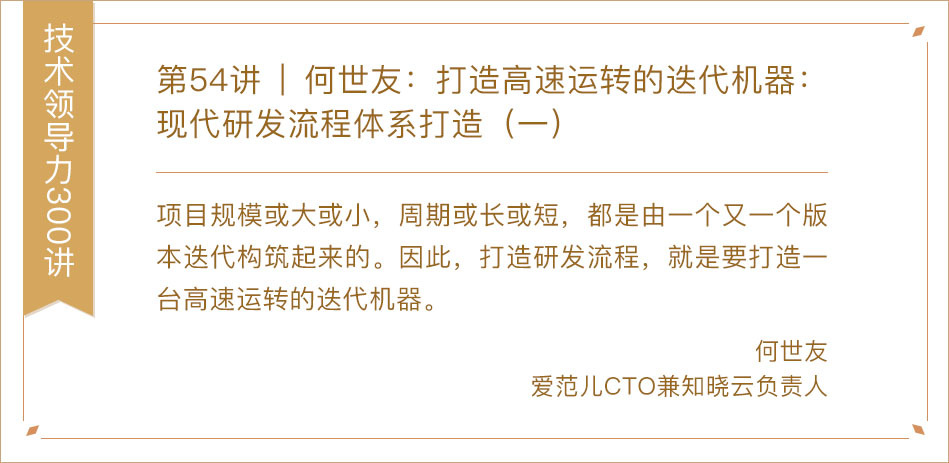
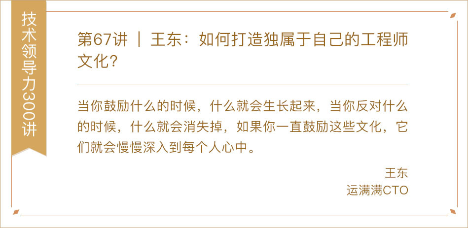
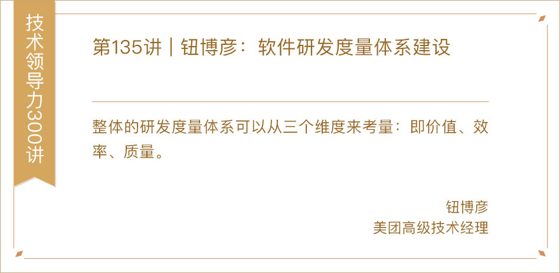
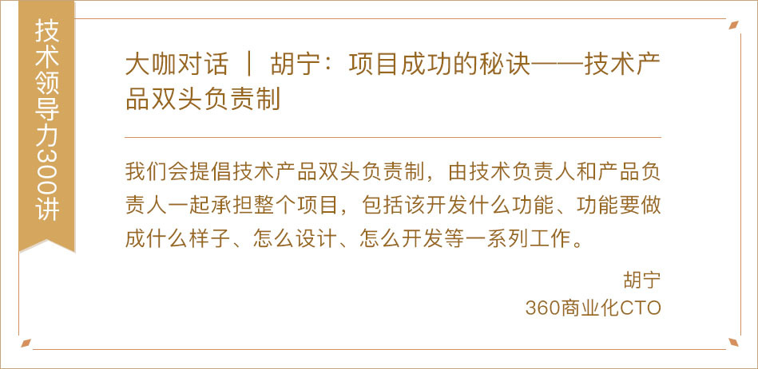

---
date: "2019-06-23"
---  
      
# 新春特辑4 | 如何打造高效的研发流程与文化？
你好，我是《技术领导力实战笔记》专栏的主编成敏，研发流程与工程师文化两者一硬一软，共同组成了高效技术团队的基石。今天专辑的主题就是“如何打造高效的研发流程与文化？”，希望你看完之后能有所收获，也欢迎留言选出你最喜欢的文章，或是分享你对于技术团队打造的实践与经验。

  
  
  
  
  
  
  
  
  
  
  
  
  
  

<!-- [[[read_end]]] -->