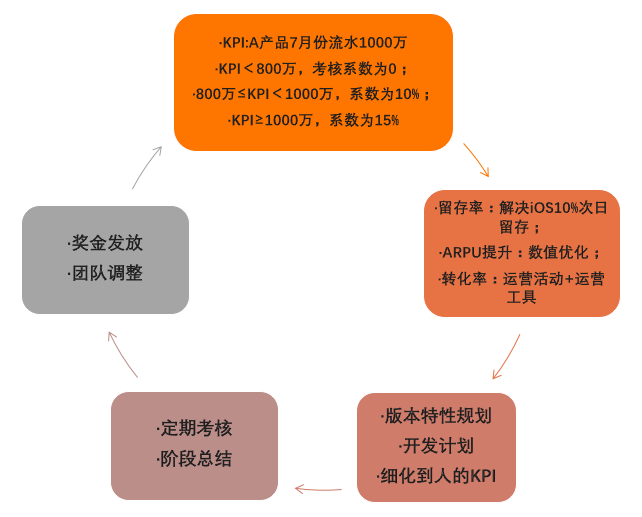

---
date: "2019-06-23"
---  
      
# 第110讲 | 成敏：创业公司为什么会技术文化产品缺失
你好，我是技术领导力300讲主编成敏，最近经常参加一些技术创业者的交流活动，听他们聊创业过程中遇到的问题、踩过的坑。

其中一个很有意思的话题是，不少创业公司的产品技术人员会觉得公司没有产品技术文化，或者市场驱动的文化盖过了产品技术文化。

对此，他们其实也很委屈，每个技术创业者在创业之前都是充满理想的，都会想要打造一个技术驱动、产品驱动、模式驱动的公司，但创业的压力实在是太大了。

几乎所有的创业公司从成立的第一天开始就会面临巨大的生存压力，包括基本生存压力、投资者压力和激烈的市场竞争这三重压力。

**1.基本的生存压力**  
很多创业公司的起始资金都是创始人自己之前积累的血汗钱，我跟很多创业者聊过，只有很少一部分人一有创业想法就能拿到VC的钱，大部分还是拿着自己的钱来创业，甚至有卖房创业，把自己全部家底投进去的。

所以，对创业者而言，公司从诞生之初就面临着非常大的压力，每天一睁眼，就是几千、几万甚至几十万的支出，账上的钱一直在减少，但收入却迟迟没有看到曙光。这时，创业之前的那些很优雅的想法，在生存的压力面前，就慢慢开始变形了。

**2.投资者压力**  
即使创业者拿了融资，不再烧自己的钱了，但是投资者不是雷锋，他给你投钱并不是为了无偿帮助你，而是想获得超出预期的回报。可能他投了一千万，但他会希望这一千万能给他带来一个亿、十个亿甚至百个亿的回报，这才是他们真正的诉求。

<!-- [[[read_end]]] -->

因此，融完资之后，可能有的投资人信任创始团队，不会过多参与过问公司经营情况，但这是少数，大部分投资者都会非常关注公司营收，可能会经常问你财务报表怎么样、营收有没有翻倍等，这些都会给创业者带去很大的压力。

**3.激烈的市场竞争**  
国内互联网行业竞争激烈，一旦出现一个新模式，马上会有几百上千家公司跟上，比如之前的O2O、P2P、共享单车，现在的区块链等等。但同样的，每个行业到最后可能只会剩下一两家公司成功存活。

互联网时代的商业规则：赢家通吃，数一数二，不三不四。 老大占据大部分市场，剩下的给老二，其他的都无声无息，没有三没有四。

这个规则就决定了，在一个细分领域里，只有成为其中数一数二的公司才有可能存活下去。这给创业者带来了极大的压力，鞭策着他们不停往前跑，无法停歇。

其实，创业者都是非常有理想的人，为了实现他们的创业理想，即使没有外界压力，他们自身也会给自己施加很大的压力，再加上这些激烈的市场压力、生存压力和资本压力，更是如座座大山压在创业者肩上心头，导致公司的实际情况离最初创业时的理想模式越来越远。

### 经营目标驱动下的研发模型

这三重生存压力带来了公司的经营压力，而有经营压力，就一定会有经营目标。

很多创业公司，在第一年、第二年的时候，因为体量比较小，在经营上会相对比较随性，但到了第三年、第四年之后，就需要开始做公司的年度商业计划，包括产品、市场、财务、人力等各个方面的计划，公司开始向经营目标驱动的模式靠近。这时，导致产品技术文化受伤的情况是，所有的计划最终都会落到一个个数据指标、一个个KPI上。

很多创业公司在最初成立的时候，都会说我们是反KPI的，但实际上到最后多多少少都会落回到KPI上。KPI本身没有原罪，它只是一个工具，只是KPI往往太过强调收入，很容易导致公司整体以经营目标为驱动，忽视了产品技术文化。

这里举个例子，图中是一个手游公司的KPI体系，他们会先设计一个目标，比如月流水达到1000万，然后整个公司就开始围绕这个目标运转。在设定目标之后，他会先反推目标，例如要达到这样的目标，要达到多少的留存率、多少的用户平均收入、多少的转化率等等。

而这些具体的指标确定之后，马上就会反应到版本特性规划、开发计划上，并细化到每个人的KPI上，付诸执行。随后就是定期考核、阶段总结，再之后是根据考核情况和目标完成情况发放奖金、调整团队等。

这就是经营目标驱动下的研发模型，所有都是围绕着经营目标而转。同时，不得不承认，除了创业的最初阶段，公司一旦走入正轨，基本上都要遵循这样的研发模型，大公司无非是整个模型体系中的环节更多、更完善。

这时就会发现，产品技术人员的创意开始让位于KPI驱动，也就是业绩经营驱动，这是很多创业公司进入融资阶段以后和规模化运营以后都会面临的情况。

### 强悍的市场文化、产品技术文化不再

这时，就很有可能出现市场文化强悍，产品技术文化弱势让步的情况。而在这种市场文化之下，产品研发人员最怕的就是需求，然而每天面对也必须面对的还是需求，而且包括来自市场的需求、来自领导的需求、竞争对手带来的需求（比如竞争对手做了一个新特性，公司也得跟上）等等。除此之外，还有为了公司长远发展而做的架构需求、规划需求，还有用户在社区中反馈的需求等等。

对于开发人员来说，在底下实际实现的时候，这些大都是在满足市场和领导的需求，其中可能还有一些很傻的需求，他们也不得不做。但在市场人员眼里，他们完全不会觉得这些需求有问题，因为都有可能给公司带来营收。两者的视角不同，观点就不同。

如此，市场文化就开始和产品技术文化产生冲突，而作为公司、作为管理者，就需要在这两者之间做出一个平衡。

产品技术文化是带有一定理想主义色彩的，每一个技术出身的创业者都希望公司是产品驱动、技术驱动、模式驱动，但实际在执行的时候，往往最先进入状态的是市场驱动。

而在市场驱动的文化下，如果你去跟其中的开发人员聊天，相信提到最多的关键字一定会是“加班、版本、进度、急”这些。很常见的一种情况就是领导发脾气，“你们的进度怎么这么慢，新版本怎么还没做好”，然后施加压力，“新版本赶快出，无论如何这周末必须给我上”。

可能刚开始的时候，这种压力对研发人员比较有效，大家能加班赶进度把新版本做出来，但长久处在市场驱动的文化下，研发人员一定会疲惫，效率就必然会不断降低，这种是一种很典型的现象。

面对这种现象，有些公司可能会从流程改进、绩效考核、员工激励等方面着手提高团队效率，可能能起一时之功，但如果继续任由产品技术文化缺失，研发人员疲于应对各种市场、领导压过来的需求，依然是治标不治本。

总结一下，当前国内的互联网行业，少有纯产品技术文化驱动的创业公司，资本裹挟和市场欲望是大部分创业公司的驱动力，这其实是创新缺失和产品技术文化缺失的主因。

不知道你是否认同这个观点，欢迎在评论区分享你的观点！