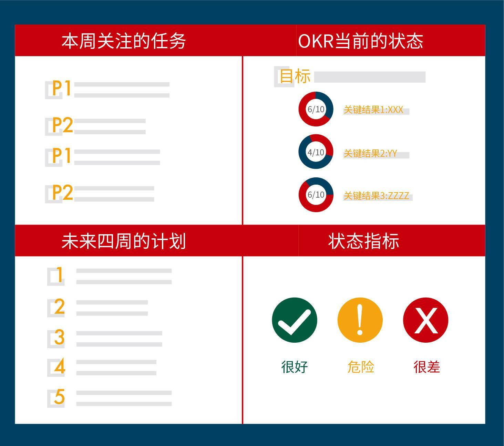
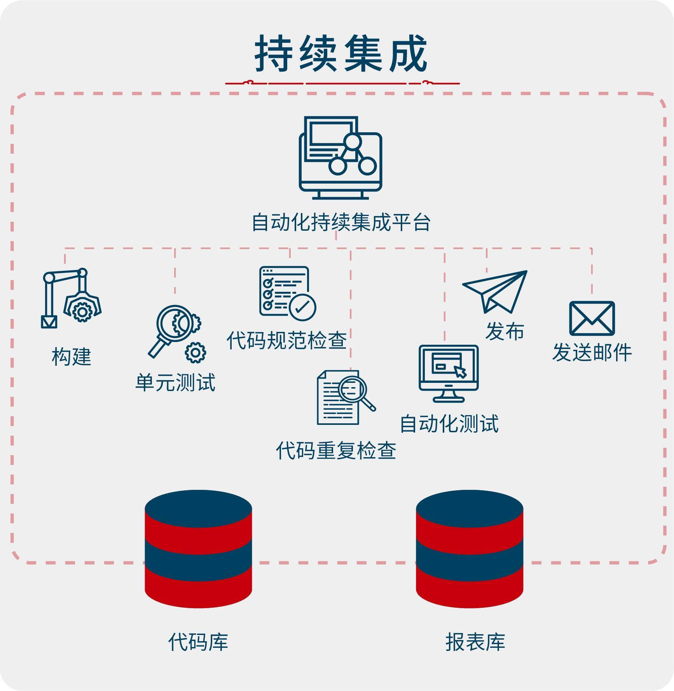

---
date: "2019-06-23"
---  
      
# 第161讲 | 卢亿雷：企业发展的不同阶段，该如何打造高效的研发流程体系
你好，我是nEqual（恩亿科）合伙人兼首席技术官卢亿雷，今天想跟你分享的话题是，企业发展的不同阶段，该如何打造高效的研发流程体系？

互联网时代，我们可以把公司分为初创期、成长期和成熟期三种类型，初创期企业讲究的短平快的模式，尽可能缩短研发层级，保证最高效的沟通；成长期企业由于发展很快，人员也越来越多，将会迫使企业通过一些系统工具和管理流程体系来进行管理；而成熟企业则必须采用成熟的工具和严格的流程体系架构来管理，所以企业所处的阶段不同，其研发流程体系也有区别之处。

## 企业发展不同阶段的研发流程体系

初创期和成长期的公司一般采用独立的产品经理负责制，这样做的优势是可以打破部门间的壁垒，拉近产品研发与市场的距离，建立以客户需求和市场需要为导向的跨部门产品组。执行产品经理负责制，是由产品经理全权负责产品全生命周期的管理，直接对产品的市场成功与否负责，对产品的损益负责，并且需要充分利用到整个公司各部门的知识、经验与技能。值得注意的是，这里所说的产品经理负责制，不仅仅要针对公司已有的成形产品，更要适用于新产品的开发，使开发过程中的产品经理能够真正具有相适应的权利。

产品经理不一定非要隶属研发中心，也可以隶属市场部。如果产品经理隶属市场部，则应该在研发中心设立与其相对应的产品研发经理，产品研发经理对产品经理负责。另外，通过产品经理制度的实施，可以为公司培养懂技术、懂管理、懂市场的中坚力量，并在一定程度上避免公司人才严重流失的情况。

<!-- [[[read_end]]] -->

处于成熟期的公司一般采用系统监控负责制，即所有的模块，包括底层系统、应用系统、会议安排、员工管理等在内的相关系统全部需要通过监控系统来实现。比如，如果某个产品的某个系统出现问题，将会由监控系统通过邮件、短信、电话等方式通知负责人，如果负责人一直不处理，就会一直通知。如果是关键系统中的关键指标，将会上升到更高一级的领导，直到有人开始处理为止。成熟期公司的研发管理制度一般包含以下几个方面：

> 有完整的研发职称体系。比如百度就有M系列（管理）、T系列（技术）等，每个员工可以根据自己的职业发展规划选择适合自己的职称体系；  
> 有完善的系统工具。比如监控系统、预警系统、工单系统、KPI（OKR）考核系统、员工管理系统等；  
> 有全面的员工培训体系。包括新员工入职培训、定期专业知识培训、定期各种马拉松竞赛等；  
> 分部门采取各种不同的开发模式。如敏捷软件开发（SCRUM、XP）、DevOps等各种开发模式。

初创期和成长期的公司也都会或多或少用到各种系统工具、各种开发模式，不过他们更多的会采取一种模式，也就是使用统一的管理方式，这样效率才会更高。

## 以人为核心的研发流程体系

为了提高公司的流程效率，管理一般有从人出发和从事出发两种方式。不管是初创期、成长期，还是成熟期的公司，要打造一个高效的研发流程体系，以人为核心的管理办法是最重要的管理方式，因为研发人员是一群高智商的人群，只有把研发人员管理好了，研发效率才会快速得到提高。以人为核心的管理方法主要是通过以人为主体，根据不同人的特点分配不同的项目，同时在项目里根据人的特长配备不同的有梯度的研发人员，保证项目顺利进行，像敏捷等开发模式就是以人为核心的一种管理方法实践。

以 nEqual 为例，nEqual 属于成长期的企业，我们重点采用以人为核心的管理方法，主要的研发流程分为如下几个方面：

1.采用类似于百度的职称体系架构，分为M系列（管理）、P系列（产品经理）、T系列（工程师）、R系列（研究员）四个职称，给技术同学提供了清晰明确的成长路径，保证了技术、产品同学可以根据职业规划来选择自己的发展方向。

2.构建了一套完整的监控系统，包括系统级监控系统和应用级监控系统。特别是应用级监控系统，由于有邮件、短信、电话预警和通知，将会极大提高研发工程的效率。同时，我们采用的是系统责任制，某个产品线所有的同学以负责系统稳定可靠性为目标，系统出现任何问题，此产品线的所有同学都要承担责任。比如某个负责子系统的工程师，凌晨收到报警后，需要完成打开电脑、连接VPN、连接服务器、查看应用程序和系统日志、定位问题、重启程序、服务正常、继续睡觉的一系列动作。

而由于我们采取的是系统责任制，如果这位工程师一天不从根本上解决此问题，那么他每天都要重复这样的事情，他自己也会受不了，一定会在接下来的时间通过优化程序，彻底解决此问题来保证自己不天天被打扰。通过这种方法，可以大大提高系统稳定性，同时也可以最大化调动研发人员的积极性，保证研发效率高速运转。

3.成立了学院，定期给研发人员分享前沿技术、系统培训分布式系统、分布式计算、分布式存储、高并发等相关理论和实践，也会让员工分享项目中遇到的问题，这样会让研发同学有系统的学习技术的机会，在以后的新项目中可以快速上手，研发效率变高，同时也让他们感觉在企业里学到了新知识，保证了他们的学习兴趣，也提高对企业的忠诚度。

4、采用OKR，即目标与关键成果法，是一套明确和跟踪目标及其完成情况的管理工具和工作方法，并在团队中共享，这样就可以在整个组织中明确目标，帮助协调和集中精力。

5.采用SCRUM的敏捷开发模式，同时内部采用持续集成（CI）、持续发布（CD）的软件开发实践，即团队开发成员经常集成他们的工作，通常每个成员每天至少集成一次，也就意味着每天可能会发生多次集成。每次集成都通过自动化的构建（包括编译，发布，自动化测试）来验证，从而尽早地发现集成错误。

6.构建了统一的公共平台和数据中台，成立了基础架构部，保证技术、数据等尽可能的复用，提高企业的整体技术能力。由于技术模块、架构等的复用，整个企业的研发效率得以更高效的发展，也让不同的研发同学能选择适合自己的技术路线，比如喜欢做基础服务的就可以去平台底层团队，想做应用层的就可以去不同的产品线服务业务团队。

7.每个月都有技术评审会，通过技术评审强化多个备选方案、把握新技术应用、体现技术合力和技术继承，保证“正确地做事”，同时让研发同学学习了解到技术选型其实是一个平衡技术与业务的问题，促进更多技术同学的架构能力得到快速发展。

## 小结

企业打造高效的研发流程体系最重要还是人的问题，一切需要以人为核心来驱动，不管我们是采用敏捷开发模式，还是通过监控预警系统来约束研发人员解决问题，系统和工具只是辅助的手段而已，还需要通过各种流程和方法来激发研发人员的潜力如完整的研发职称体系、完善的培训体系、标准的系统责任制度、自动化的系统监控系统、流程化的技术评审会、OKR的管理工作方法等。

## 作者简介

nEqual（恩亿科）合伙人兼CTO，TGO鲲鹏会会员，CCF（中国计算机学会）大数据专委委员，北京航空航天大学特聘教授，中国大数据技术大会主席，2017年大数据行业领军人物。关注数据的采集、清洗、存储、挖掘等整个数据流过程，对分布式存储和分布式计算、超大集群、大数据分析、机器学习、数据安全等有深刻理解及实践经验。有超过12年大数据、人工智能、区块链、数据安全等经验。曾在联想、百度、Carbonite工作，并拥有多篇大数据相关的专利和论文，高教出版社《大数据导论》等书的编写作者。