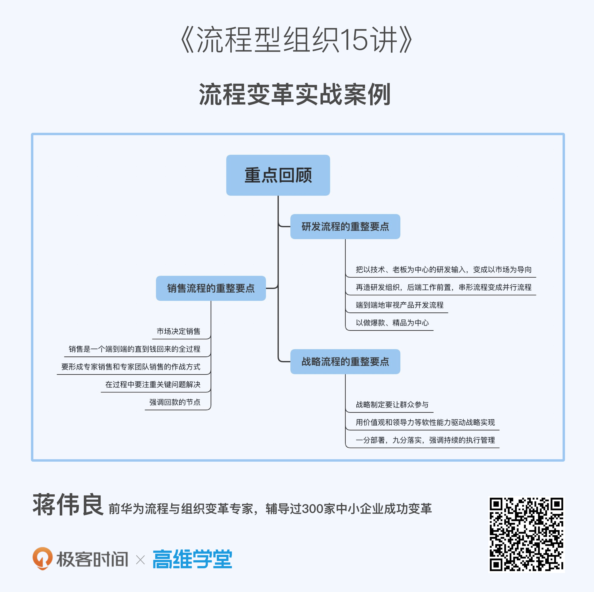

---
date: "2019-06-23"
---  
      
# 07 | 流程变革实战案例三：战略流程的重整要点
你好，我是蒋伟良博士。聚焦战略，简化管理，实现有效增长。欢迎你和我一起学习《流程型组织15讲》这门课。

今天是第7讲。上次我们讲到了销售流程的变革，也讲了研发流程的变革，我们今天来探讨最高端流程的变革——关于战略流程的变革。

首先来思考一个小小的问题，在企业管理中到底是战略大还是流程大？你可能会毫不思索就说战略大，因为战略决定了一切，但在我们的价值观中是流程比战略更大，因为我们说企业是由各条流程构成的，而战略管理只是其中之一，所以从流程的范围、广度来看，它是大于战略的。

为什么我们会说战略比流程大？因为大多数的同学都是局部的功能性思维，而不是整体的系统性思维。我们会看到，战略虽然在企业管理中是非常重要的关键环节，但是它依然是流程的重要组成部分，这就给我们一个全新的启发和观点：我们要用流程的观点去看待战略。

### 用流程的观点看战略

我们讲，一个好的战略就是要从战略的规划到执行，形成一个流程。坏战略就会以漂亮的工具、漂亮的报告、漂亮的外表，去掩盖企业管理问题的本质，我们需要用各种各样的目标和分解去代替战略管理，实际上是目标管理；而一个好的战略会直指人心，它会指向关键问题的解决，指向战略的机会，形成战略控制，同时也不是从规划到规划，而是从规划到执行落地。所以它要强调，**执行是战略管理的重要组成部分，执行的成功才是真正的战略成功所在，指向流程的重要思想——就是端到端。**

<!-- [[[read_end]]] -->

很多公司的战略是虎头蛇尾的，因为他们会非常注重年初的目标制定，喜欢定像收入、利润这样的财务指标，然后进行分解。同时他们会认为战略是老板的事情，而不是整个组织的事情，会把老板的个人意愿，作为战略的重要组成部分，而大家只是执行者。那就错了。我要说战略是全体员工每个人的事情，必须把它构画成共同的一个从民主到集中的过程。

所以战略是一个端到端的全流程，我们强调端到端，就是要从前期战略的洞察，观察内外部世界、环境、客户需求、趋势、技术发展方向，同时来思考公司的核心的战略机会点到底是什么。我们强调战略机会点，需要通过整个组织的能力去打造，去发现和抓住，同时我们要把战略机会点转化成为战略的控制点，这个控制点低则是我们的成本优势，中则是我们的差异化优势，高则是我们的品牌、技术、专利优势，也就是无可撼动的护城河，核心竞争力。

### 如何让战略管理形成一个流程

所以从战略的机会点到控制点，就是流程必须涉及的分析要点。基于控制点，我们来思考战略的方向和目标。方向就是我们的策略，到底是往东走还是往西走，到底是国际化还是国内进行精耕细作。实际上每一个企业都要去思考，它所指的战略到底是什么，可能战略核心的策略就几句话而已，但是它指直人心，基于这个方向，我们来定出目标。目标就是那个点，不管是财务目标还是非财务目标，都是以这个点进行设计的。之后我们再开展，进行公司三年的战略规划和年度的经营计划，我们叫做“三年SP”和“年度BP”。

刚才我们讲的过程实际上就是从战略洞察到战略制定，之后就到了战略的解码和战略的执行管理。从解码的角度看，我们要进行两个维度的分解，以前企业很喜欢从部门维度进行分解，今天已经不够了，我们要非常注重按照项目维度分解，按照重要工作维度分解，这样就形成整个组织既有纵的部门导向，又有横的流程导向。

在整个战略的制定过程中，我们要非常注重达成共识，这就要让群众参与，让群众在过程中一起沟通、思考、碰撞，让公司的高层再来做出决策。所以这不是过去老板说话算数，而是群众一起来碰撞，老板形成决策，这就是民主集中制，这个过程最关键的就是一个词——共识，战略如果不能达成共识，越往后走，执行上就越会衰减，在执行中就会大大折扣。

在有效决策方面，我们并不是去寻找一个完美答案，而是通过战略思维、系统能力去寻找一个接近正确或可能错误之间的答案。接近正确就是不要求完美，是基于我们的常识，基于我们对行业的理解，做出重要的判断。之后，我们落实在执行管理上。过去很多公司做战略管理，做出了漂亮的PPT报告，这个事就结束了。然后就束之高阁，等到年底一检查，就发现只执行了百分二三十，全年的目标肯定无法达成。为什么会出现这样的现象和问题？就是因为没有战略导向的工作，大量的日常工作都是问题导向的，都是基础工作导向的，所以这时候我们就会对自己说，计划赶不上变化，我想说这是完全错误的思想。

### 如何执行好公司的软实力

强大的计划和预测，强大的战略思维，是完全可以用这样的确定性去面对世界的不确定性的，所以我们必须把核心的重点放在执行上，这就叫做“一分部署，九分落实”。执行的要点，我要强调“软就是硬”。

什么是软呢？软就是大量的软性工作，我们来列举一下，比如说价值观和领导力建设；关键人才培养；关键的组织建设和保障；战略绩效的分解，从战略到组织绩效到个人绩效，然后到战略的激励管理；在整个战略执行过程的预算和人力资源管理，信息化的规划等等，可以说这些职能的规划对战略的持续迭代、持续复盘、持续纠偏和调整都是非常重要的。这些就构成了战略管理的软要素。

这些软性工作是构成战略执行的关键要点。实际上我们讲人才、组织、KPI，也就是阿里经常讲的“下三路”，恰恰是整个战略执行的关键，我们必须要非常注重下三路。

过去我们必须注重硬，硬就是拉单，搞定客户，我认为这是没有错的，不过必须要认识到软有的时候就是硬。所以我们要想一想，战略是走向未来的一个艰苦过程，在艰苦的跋涉过程中，如果没有价值观和领导力的引领，没有强大的组织保障，就算业务能够短期实现，也无法实现长期的成功。

这就要求我们必须把大量的时间放在这些工作上，比如说价值观和领导力的建设，这就是战略成功的关键之一，我们要通过价值观决定战略，用领导力引领战略，同时驱动干部和关键人才培养，让他们从过去的对管理威权的迷恋，走向领导力，这就形成了引领的力量，是一种内心的力量，是人的力量，是使命的力量，去驱动战略实现。

同时我们要高度注重人才和组织保障，当战略面对未来的时候，会发现人才和组织不够了，这就要求把传统的人力资源工作，传统的组织建设工作，迷恋于组织结构调整，迷恋于局部优化，变成战略导向，这个时候我们就要以战略为出发点和终点去进行人才储备和组织变革。

同时我们的流程型组织变革，实际上是指向公司战略和未来的，这就要求我们的变革是战略实现的核心抓手，就是要通过变革的手段来实现战略的落地。我们在资源保障方面，要强调向人力资源和预算倾斜，不能是管控型的，必须是面向战略的，要以战略为导向，来进行预算的支持和调整。

同时要以战略为导向，进行人力资源的匹配，在持续的迭代过程中，强调抓铁有痕，久久为功，每个季度都要对战略的目标和工作进行持续的检讨、复盘，每项工作到底做得怎么样？为什么做得不好？如何做得更好？资源保障了吗？下一步应该怎么办？需要做什么样的调整？同时我们会发现，有的时候必要的调整也是应该的，如果外部环境发生了变化，我们不管是财务目标还是非财务目标，都可以进行动态调整，才能形成滚动向前。

在发展过程中，我们每个季度要去看年度，每个半年要去看三年，持续滚动，就形成了滚滚向前的战略推动力。这就是我要强调战略管理整个端到端的力量。我不敢保证一个流程走一遍就能够实现战略，但是我敢保证，如果我们抓铁有痕，久久为功，就能够持续地指向战略目标，引领整个组织前行。

所以战略最后的本质就形成了一种组织的力量，战略管理的流程，就是这一路过来我们要强调的：传统的战略管理，仅仅是设计，仅仅是计划，仅仅是定位，但今天不够了，今天强调是组织能力。所以战略的管理是一个科学、是一个流程，形成了整个完整的系统。我们强调，战略管理的主导也不是老板，而是一条龙经理，我们把他叫做战略经理，战略经理要引领我们进行战略规划，进行民主分析，形成战略报告，同时带领经营团队进行战略的决策，他也是战略执行管理的重要负责人，在全过程中对战略的过程管理进行迭代。

刚才我讲的就是从过去传统的坏战略，迷恋于局部问题和利润达成，真正走向了依靠组织能力、系统能力，指哪打哪的战略管理，这就是整个战略上升到流程管理的高度了。

### 总结

关于这一讲我来做个总结。我们看到了整个战略管理形成了一个流程，战略管理是一个从规划到执行的端到端，是从战略的洞察到战略制定、战略解码，到战略执行的过程。我们看到了民主的力量，民主集中最伟大，通过群众的力量和有效的决策，形成对战略的管理能力。我们同时强调“软就是硬”。什么是软？就是用价值观和领导力和组织能力去驱动战略实现。

所有这些构成了今天全球60年以来整个战略管理的最高境界，战略真正形成了从艺术、创意变成了一种组织能力，变成了一种指哪打哪的能力，变成了一种科学。我们依靠一个完整的流程，持续的迭代，强调一分部署，九分落实，强调持续的执行管理，最终形成整个组织的战略管理能力。

在我过去的实践中，我惊讶地发现，通过战略管理流程来驱动的组织，每个员工都好像找到了使命和方向，他们有了责任感，他们知道公司的战略是自己工作的重要来源，自己也是整个公司战略的重要组成部分，他们全身心投入到战略上，我欣喜地看到以战略制导形成组织，他们可能在一年内，业绩呈现几倍的翻番，就是因为他们找到了厚积薄发的点，找到了正确的方向，找到了整个组织能力，形成了“全营一杆枪”的巨大力量。

同时老板也从过去他负责战略变得轻松了，因为群众站起来了，群众在战略中起到决定关键性作用，老板做好关键决策即可，我想这就是战略管理的最高境界。下一讲我们分享继续。

