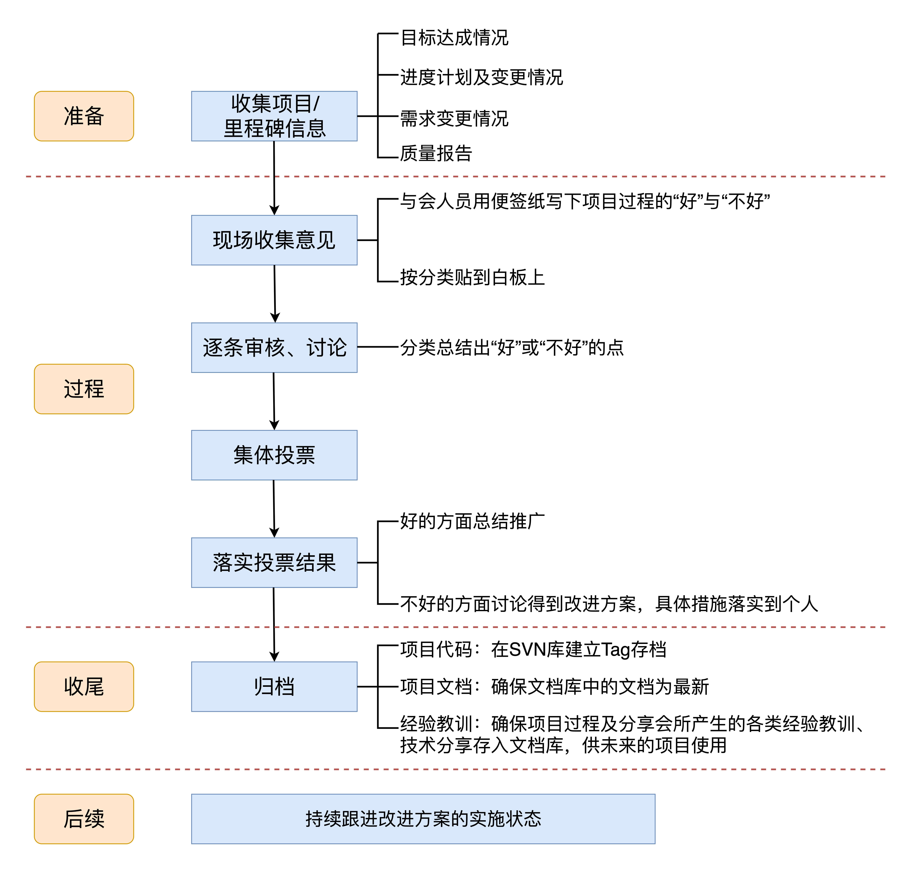
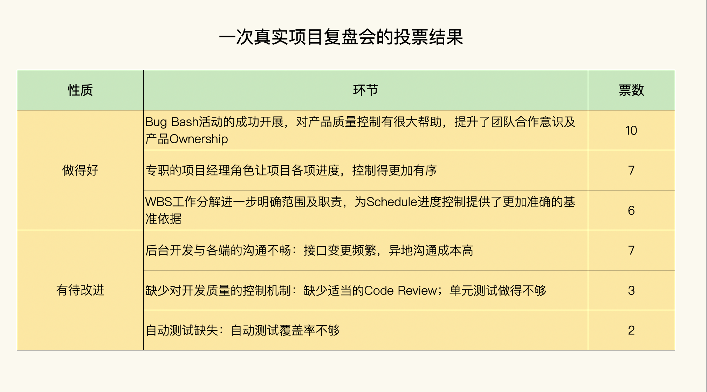

---
date: "2019-06-23"
---  
      
# 09 | 需求变更：三个锦囊，让需求变更不再是洪水猛兽
你好，我是雷蓓蓓。今天，我们来聊一聊如何应对需求变更这个话题。

需求变更一直都是一个热门话题，特别是在奉行唯快不破的互联网公司，需求变更可以说是程序员的头号噩梦，也是“996”的直接元凶。

阿里有句非常有名的口号，叫作拥抱变化。既然需求变更无法被消灭，那么我们就要通过学习，掌握更好地应对需求变更的方法。我们先来看看常见的需求变更流程。

首先要发起变更申请，由变更委员会来综合评估，评估的内容包括变更范围、风险、对现有计划的影响程度等，以此来判断是否接受变更。变更委员会一般是由产品leader、技术leader、测试leader及项目经理组成，如果接受变更，那么就需要判断项目计划是否需要进行相应的调整，最后公告处理结果。

讲到这里，我注意到艾文脸上的表情明显有些困惑，就邀请她来说说，艾文一开口就颇为直接：“老师，这个流程其实本身很简单，书上都这么写，我也知道要这么做，但现实是……除了我之外，团队没人愿意这么干！人微言轻，实在是做不到啊！”

我对艾文的直言不讳表示赞许，“不错，坦诚直面问题是第一步。说说都容易，关键在于能否有效执行。”

那么在这一讲，我会给你介绍几种实战下来亲测有用的方式，你可以把它们作为自己的“防身锦囊”。

<!-- [[[read_end]]] -->

## **锦囊1：达成最小共识：变更是有代价的**

想当年，我跟你一样，是个初出茅庐的小姑娘。刚到A团队的时候，交互妹子就可怜兮兮地拉着我说：“2个月过去了，我们的第一个版本还在打磨，80\%的交互稿都已经改得大不一样了，越是临近上线越是不断地改。如果你去跟策划们争辩，对方就甩过来一句‘老大要加的’，你说怎么办呢？”这个“老大”也就是A业务的负责人。他是产品经理出身，又是完美主义，加说一不二的性格，于是，产品策划在团队中有绝对的话语权。

在耐心地观察了一番之后，我终于等到了时机。在版本结束的复盘会之前，我跟负责人建议说：“你看，我们项目组是全新的团队，成立两个多月了，这么长时间运行下来，还是有不少问题的。我们需要一次深度复盘，这次复盘非常重要，你一定要来参加！”

复盘会的当天，大家匿名写纸条，分别列出各个环节做得好与不好的地方，贴到白板上。看着满墙花花绿绿的便签，写满了各个角色对需求变更的各种吐槽，这位负责人沉默了好久。

接着，我把事先准备的表格拿出来，表格中记录着历次变更给团队带来的各项成本增加及引发的返工（如下表）。

在复盘会接近尾声的时候，业务负责人当场发话：“从今天开始，团队里的需求变更要严格控制，从我自己做起！”在这之后，产品策划的随意变更行为显然收敛了很多。而我也趁势在下一次的全员会上，跟所有团队成员约法三章，把复盘会上的共识，细化成了具体流程：

1.  所有需求及所有变更必须建单，无单需求开发有权不接；
2.  需求变更必须经过变更委员会评估成本，变更成本较大的，要提交项目经理更新时间计划，并告知全员；
3.  对于确认通过的变更，产品人员要发送邮件，让全项目组人员都知道。

这样一来，大家对于需求变更这件事，就从上到下达成了一个基本共识，需求变更的压力也瞬间得到了缓解。所以，要想改变现状，首先就是**找到合适的时机，树立对变更的最小共识**。之所以说最小共识，是指这个共识不需要一步到位，如果你的环境下确实比较困难，可以只是前进很小的一步，比如你可以从所有变更都需要记录，并公告周知开始。

达成这个最小共识，是要让团队开始慢慢认识到，**需求变更是有代价的**。但是，毕竟产品仍然在探索期，变更总是在所难免的。

怎么办呢？策划们开始想各种办法，好让技术能够顺利地接受变更。实验下来最有用的一招，莫过于请程序员们吃炸鸡了。当时坊间流传着一个段子：“没有一桶炸鸡解决不了的变更，如果不行，那就两桶！”在整体项目时间有要求的情况下，请程序员吃炸鸡，也确实成了项目快速推进的有效选择。作为项目管理，你要谨记，**我们追求的是达成项目目标，而不是零变更**。

上面讲的这些，其实是变更发生之后的应对方法。那么，回到变更的源头，我们可以做些什么呢？

首先，就是把关需求的质量，避免需求问题流到下游，我在第6讲中介绍的Bug Bash，就是一个好方法。建议你在一些大版本上，需求设计稿完成时，发动团队的力量去做一轮全面的需求检查，调动各个角色的早期深度参与，对需求变更的防治很有效。

## **锦囊2：源头治理，一次把事情做对**

艾文听到这里，忍不住拍手称赞：“锦囊1好棒！原来需求变更的流程，是这样一步一步共识建立起来的，我终于明白了。”“嗯……不过，我们团队的需求质量实在是很着急，上线时间又都是定死的，我担心只有这些，事后应对还不够，到头来一改再改，压缩的还是开发时间，有没有办法可以从源头杜绝隐患呢？”

说得对，要想真正把关需求的质量，还是得从源头开始治理。

接下来，我来跟你分享一个几年前，我在某事业群启动中台建设项目的真实案例。这个事业群当时已经有三四年的历史了，伴随着多条业务线的高速发展，公共平台的架构频频遭遇掣肘。这个事业群的老大几经思索，下定决心花大力气快速进行中台整治。情急之下，他找到我，让我来负责这个超级复杂的项目。

在四个月内，我们重整了这个平台积累了四年的整个业务和技术架构。当时时间非常紧张，四五条业务线的产品和设计人员都会参与其中。作为新的中台架构，如果在后续执行中发生变更，往往会产生灾难性的影响。怎么办呢？

我急中生智：“小黑屋集中开发呀！”不同的是，这次被关进小黑屋的，不再是苦哈哈的程序员，而是产品和设计。他们以前哪经历过这个啊？纷纷念叨着：“What？项目还没怎么着，先把产品和设计的deadline定了？！”于是，我找来那位老大站台，召集全员，开了次隆重的启动会。会议的第二天，十几位产品和设计人员就搬进来了。

为了减少后期的变更，尽可能一次把事情做对，我们在小黑屋搞起了上墙文化，产品和设计的Deadline排期图、产品模块设计图、页面逻辑跳转图……还有各种设计草图，全都被搬上了墙。

没过几天，这里居然成为了程序员午饭后驻足观赏的胜地。见到如此盛况，我们开始给游客们准备各色小标签，让他们在游览的同时随时发表各种评论。大家的参与热情空前高涨，很多需求和设计的漏洞就在这里被提前发现、及时讨论并修改掉了，有效地保障了早期需求和设计的质量。

其实，这个项目中每个业务线都有自己的策划，如果采用传统方式，这些需求各自成稿，再加上不同业务线策划之间、策划与设计之间、设计与开发之间、反复沟通的成本，不知道要拖到猴年马月才能真正确认，又不知道会埋下多少坑。

不得不说，这个锦囊是个大招，使用起来有一定难度。但**从变更的源头开始治理，从源头开始公开透明，一次把事情最对，实际上是最有效率的方式**。小黑屋 + Deadline的实践效果奇佳，在一些上线时间有严格要求的复杂项目上，你绝对可以考虑下！

## **锦囊3：快试错，不可抗力巧应对**

学会了前面两个锦囊妙计，来自产品经理的变更就不在话下了。不过，现实情况是，很多变更来自大老板或大客户，这些不可抗力，我们又该如何应对呢？

我的建议是，**不要直接顶回去，要去剖析、把握和满足老板或客户的真正诉求**。你可能会说，说起来容易，那如果老板或客户还是一定要改怎么办呢？

我的一个团队在被大老板的各种任性变更摧残了半年以后，终于痛定思痛：“我们一直想着法儿地对抗变更，大家都身心俱疲。反过来想想，其实老板也是人，老板也很痛苦，我们要给老板试错的机会，不是吗？”

后来，我们不再一味地抗拒，不过也并没有放弃努力。相反，我们尽可能想办法降低试错成本，为了隔离老板的需求对整个团队进度的干扰，我们在常规团队之外，组建了一个**老板需求响应小分队**，由团队轮流值班，协同提高响应速度，让老板可以试得快，试得爽！同时，对于那些我们并不太认同的老板需求，**就快速尝试，小范围灰度发布，用对比数据说话**。当这一系列机制运转顺畅之后，我们慢慢发现，老板提需求时不会每次都火急火燎了。

很多同学把这类来自老板的变更视为不可抗力，实际上，这背后还是有一定的改进空间的。你可以从建立快速有效的响应机制开始，同时多去总结和剖析这些需求背后的原因，毕竟老板要的是效果，那你就得用数据说话，更好地应对这些需求变更。

## 总结

这一讲，我给你分享了3条锦囊妙计，建议你从达成一个最小共识开始入手，让团队意识到变更是有代价的。然后再往前一步，从源头开始深入，集中保障需求质量，争取第一次就把事情做对。另外，关于来自老板或客户的需求变更，你要快试错，巧妙应对。

最后，借用留言区一位同学，对本节需求变更方法论的25字箴言来总结：“以疏治堵，源头治理，顺势而为，闭环优化，数据说话。”

如果你把需求变更当作洪水猛兽，各种严防死守，那么最后你很有可能身心俱疲。但如果你换一个视角，从失败中汲取教训，变堵为疏，那么需求变更就不再是你的敌人。你会看到一个产品不断追求完美的底层动力，从而找到更多的锦囊，帮助这个产品走向更大的成功！

## **畅所欲言**

听了这么多锦囊，希望你聊一聊你和需求变更的“战斗”史，分享一下你在实战中最有效的方法！

欢迎你畅所欲言，我在留言区等你，也欢迎你把文章分享给你的朋友。